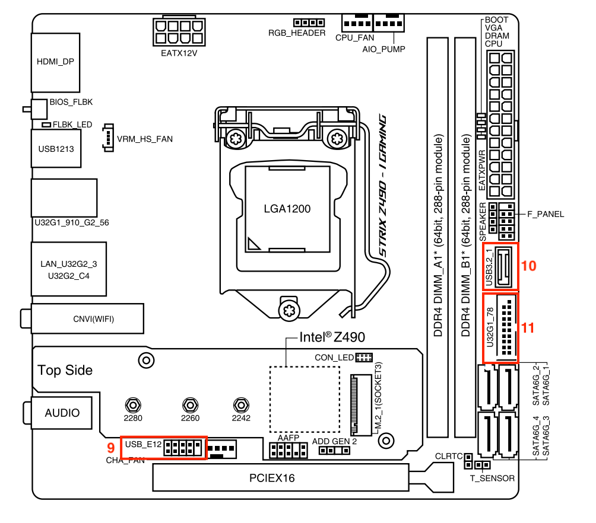
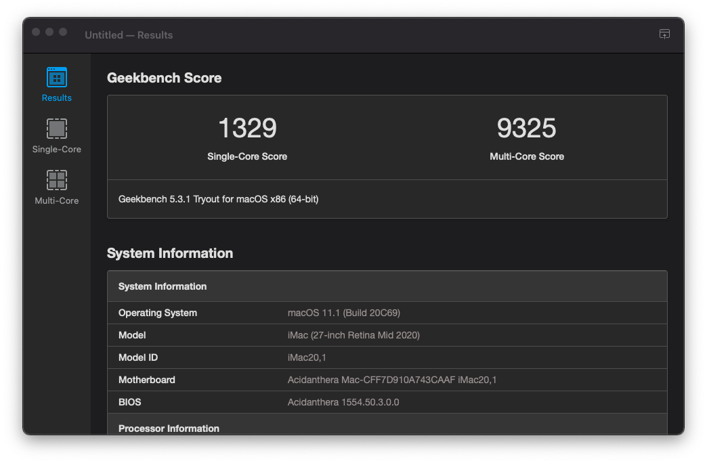

# Hackintosh - Asus ROG Strix Z490-I Gaming (OpenCore)

[](https://github.com/acidanthera/OpenCorePkg/releases/tag/0.6.6)
[](https://www.apple.com/macos/big-sur/)
[](https://www.asus.com/Motherboards/ROG-STRIX-Z490-I-GAMING/)
[](#)

本项目适用于 **华硕 ROG Z490I Gaming** 主板和 **Intel 十代 CPU**  （Comet Labke）。

由于没有使用苹果兼容的 BCM 系列网卡，所以不会有 Airdrop 和 Handoff。

该 EFI 可以直接使用板载的 CNVI网卡和蓝牙，WIFI可连接但不稳定，Bluetooth 工作正常， MagicMouse 2 和 Airpods Pro 都可以正常使用。

⚠️ 请先熟读 [OpenCore Install Guide](https://dortania.github.io/OpenCore-Install-Guide/) 然后再动手。

不要忘记修改 `EFI/OC/config.plist` 生成自己的 SMBIOS 信息. 请参阅: [Comet Lake Config Guide](https://dortania.github.io/OpenCore-Install-Guide/config.plist/comet-lake.html#platforminfo)


## 硬件

* **主板:** [Asus ROG Strix Z490-I Gaming](https://www.asus.com/Motherboards/ROG-STRIX-Z490-I-GAMING/)
    * **Ethernet:** Intel I225-V 2.5Gbit
    * **Wi-Fi/BT:** Intel AX201NGW
    * **Audio:** Realtek ALCS1220A
* **CPU:** [Intel Core i7-10700K](https://ark.intel.com/content/www/us/en/ark/products/199335/intel-core-i7-10700k-processor-16m-cache-up-to-5-10-ghz.html)
* **显卡:** Intel UHD630 (集成显卡)
* **内存:** [G.SKILL Trident Z Neo DDR4-3200MHz 32GB(16GB×2)](https://www.gskill.com/product/165/326/1562838932/F4-3200C16D-32GTZNTrident-Z-NeoDDR4-3200MHz-CL16-18-18-38-1.35V32GB-(2x16GB))
* **硬盘:** [WD-Black SN750 500GB M.2 NVMe](https://shop.westerndigital.com/products/internal-drives/wd-black-sn750-nvme-ssd#WDS250G3X0C)
* **WIFI/BT:** Onboard CNVI Intel AX201NGW

## 软件

* OpenCore: 0.6.6-RELEASE
* OS: macOS Big Sur 11.2 (20D64)

## 可用
- [x] Intel UHD630 (iGPU)
- [x] Audio Realtek ALCS1220A 声卡
- [x] Intel I225-V 2.5Gb 有线网卡
- [x] Wi-Fi, 重启后可以连接上
- [x] 蓝牙
- [x] USB
- [x] 重启/关机
- [ ] 休眠： 由于休眠后 HDMI 无法唤醒，所以禁止了休眠
- [x] 电源管理
- [x] 系统升级

## 详情
设备属性: 


### 显卡
#### Intel UHD630

HDMI/DP 音视频输出正常.

修改配置:

> AAPL,ig-platform-id=07009B3E

```xml
<key>PciRoot(0x0)/Pci(0x2,0x0)</key>
<dict>
  <key>AAPL,ig-platform-id</key>
  <data>BwCbPg==</data>
  <key>framebuffer-patch-enable</key>
  <data>AQAAAA==</data>
  <key>framebuffer-stolenmem</key>
  <data>AAAwAQ==</data>
</dict>
```

### 音频

需要 Kext:
* AppleALC.kext

修改配置:
> layout-id=01000000

```xml
<key>PciRoot(0x0)/Pci(0x1f,0x3)</key>
<dict>
  <key>layout-id</key>
  <data>AQAAAA==</data>
</dict>
```

### 有限网卡 

需要 Kext:

* FakePCIID.kext
* FakePCIID_Intel_I225-V.kext

修改配置：
> device-id=`F2150000`

```xml
<key>PciRoot(0x0)/Pci(0x1C,0x4)/Pci(0x0,0x0)</key>
<dict>
    <key>device-id</key>
    <data>8hUAAA==</data>
</dict>
```

`FakePCIID_Intel_I225-V.kext` 可以参考 [2.5Gbit Ethernet (Intel I225-V) Don't work #8](https://github.com/SchmockLord/Hackintosh-Intel-i9-10900k-Gigabyte-Z490-Vision-D/issues/8).

### Wi-Fi/BT
由于主板自带 CNVI 的网卡，这个接口不可以替换为 BCM 的兼容网卡（例如BCM94360NG 是不能用的，因为CNVI协议问题），如果要用兼容网卡需要占用一个 m.2 接口。而我是 Windows 和 Hackintosh 各一个硬盘，所以就无法用兼容网卡。

好在使用 [IntelBluetoothFirmware](https://github.com/OpenIntelWireless/IntelBluetoothFirmware) ，板载的 CNVi 网卡和蓝牙可以直接使用了。 我的三个蓝牙设备 MagicMouse 、Airpods Pro 和 Flico 圣手二代都工作正常.

所需Kext:
* IntelBluetoothFirmware.kext
* IntelBluetoothInjector.kext
* AirportItIWm.kext

### USB




| No. | 类型 | 端口 |
|-----|------|------|
| 1   | USB 2.0 | HS12 |
| 2   | USB 2.0 | HS13 |
| 3   | USB 3.2 Gen 1 | HS09/SS09 |
| 4   | USB 3.2 Gen 1 | HS10/SS10 |
| 5   | USB 3.2 Gen 2 | HS05/SS05 |
| 6   | USB 3.2 Gen 2 | HS06/SS06 |
| 7   | USB 3.2 Gen 2 | HS03/SS03 |
| 8   | USB 3.2 Gen 2 | HS04/SS04 |
| 9   | USB 2.0 Hub | HS11 |
| 10  | USB 3.2 Gen 2 | HS01/SS01 |
| 11  | USB 3.2 Gen 1 | HS07/SS07 + HS08/SS08 |

> 所有端口: HS01 ~ HS14, SS01 ~ SS10, USR1 ~ USR2
>
> HS02: AURA LED 控制器 /  HS14: 板载蓝牙
>
> SS04, HS01/SS01, HS07/SS07, HS08/SS08 未知.

需要注意的是，板载蓝牙对应的 `HS14` 要进行映射，不然蓝牙无法进行使用。由于 15 个 USB 限制，所以这里放弃了编号 2 的USB口，即 HS13.

所需 Kext:
* USBPorts.kext


### 休眠 (未完成)

### F1 启动错误

修改配置文件，在 `Kernel -> Patch` 加入以下配置:

```xml
<dict>
    <key>Base</key>
    <string></string>
    <key>Comment</key>
    <string>F1 Startup patch</string>
    <key>Count</key>
    <integer>1</integer>
    <key>Enabled</key>
    <true/>
    <key>Find</key>
    <data>dTMPtw==</data>
    <key>Identifier</key>
    <string>com.apple.driver.AppleRTC</string>
    <key>Limit</key>
    <integer>0</integer>
    <key>Mask</key>
    <data></data>
    <key>MaxKernel</key>
    <string></string>
    <key>MinKernel</key>
    <string></string>
    <key>Replace</key>
    <data>6zMPtw==</data>
    <key>ReplaceMask</key>
    <data></data>
    <key>Skip</key>
    <integer>0</integer>
</dict>
```

### BIOS 版本

> Version: 0707

#### ❌ 禁用项

* Fast Boot
* VT-d
* CSM
* Intel SGX
* CFG Lock ( BIOS 中不存在, 默认是 unlocked. 所以 `AppleCpuPmCfgLock` 和 `AppleXcpmCfgLock` 设置可以不用处理)

#### ✅ 启用项

* VT-x (BIOS里没有这项，默认是开启的，需要注意有一项XXX需要启用！不然虚拟机统统无法使用)
* Above 4G decoding
* Hyper-Threading
* EHCI/XHCI Hand-off
* OS type: Windows UEFI Mode (Clear Secure Boot Keys or choose `Other` type)
* DVMT Pre-Allocated(iGPU Memory): 64MB

### EFI

#### SSDTs

参照 [Dortania's ACPI Guide](https://dortania.github.io/Getting-Started-With-ACPI/), 使用SSDTTime，超级方便！

* DSDT.aml
* SSDT-EC.aml
* SSDT-PLUG.aml
* SSDT-AWAC.aml
* SSDT-USBX.aml
* SSDT-USB-RESET.aml

#### Kexts

* AirportItlwm `1.2.0`
* VirtualSMC.kext `1.2.0`
* SMCProcessor.kext `1.2.0`
* SMCSuperIO.kext `1.2.0`
* Lilu.kext `1.5.1`
* WhateverGreen.kext `1.4.7`
* AppleALC.kext `1.5.1`
* NVMeFix.kext `1.0.5`
* IntelBluetoothFirmware.kext `1.1.2`
* IntelBluetoothInjector.kext `1.1.2`
* FakePCIID.kext (from RehabMan `2018-1027`)
* FakePCIID_intel_I225-V.kext (from SchmockLord)
* USBPorts.kext

## 其他

### 所需工具

* [GenSMBIOS](https://github.com/corpnewt/GenSMBIOS) 生成 SMBIOS 信息
* [Hackintool](https://github.com/headkaze/Hackintool) 黑苹果必备工具
* [MaciASL](https://github.com/acidanthera/MaciASL) 编译 SSDTs
* [MountEFI](https://github.com/corpnewt/MountEFI) 加载 EFI 分区
* [ProperTree](https://github.com/corpnewt/ProperTree) 修改 plist 文件
* [SSDTTime](https://github.com/corpnewt/SSDTTime) 自动生成 DSDT

### 截图
Geekbench CPU:


Geekbench GPU:


## 参考

* Acidanthera for [OpenCorePkg](https://github.com/acidanthera/OpenCorePkg)
* Dortania for [OpenCore Install Guide](https://dortania.github.io/OpenCore-Install-Guide/)
* SchmockLord for [Hackintosh-Intel-i9-10900k-Gigabyte-Z490-Vision-D](https://github.com/SchmockLord/Hackintosh-Intel-i9-10900k-Gigabyte-Z490-Vision-D)
* jergoo for [Hackintosh-ROG-STRIX-Z490I](https://github.com/jergoo/Hackintosh-ROG-STRIX-Z490I)
* All contributors to the hackintosh system

